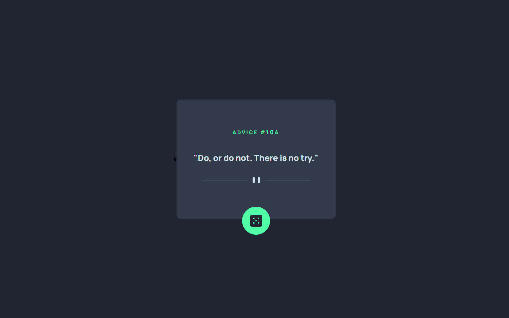

# Frontend Mentor - Advice generator app solution

This is a solution to the [Advice generator app challenge on Frontend Mentor](https://www.frontendmentor.io/challenges/advice-generator-app-QdUG-13db). Frontend Mentor challenges help you improve your coding skills by building realistic projects.

## Table of contents

- [Frontend Mentor - Advice generator app solution](#frontend-mentor---advice-generator-app-solution)
  - [Table of contents](#table-of-contents)
  - [Overview](#overview)
    - [The challenge](#the-challenge)
    - [Screenshot](#screenshot)
    - [Links](#links)
  - [My process](#my-process)
    - [Built with](#built-with)
    - [What I learned](#what-i-learned)
    - [Continued development](#continued-development)
    - [Useful resources](#useful-resources)
  - [Author](#author)
  - [Acknowledgments](#acknowledgments)

## Overview

### The challenge

Users should be able to:

- View the optimal layout for the app depending on their device's screen size
- See hover states for all interactive elements on the page
- Generate a new piece of advice by clicking the dice icon

### Screenshot



### Links

- Solution URL: [Frontend Mentor](https://www.frontendmentor.io/challenges/advice-generator-app-QdUG-13db/hub/responsive-web-application-using-html-css-and-js-VPYBDP1h-U)
- Live Site URL: [Advice Website](https://muralidharabhat.me/advice-generator-app)

## My process

### Built with

- Semantic HTML5 markup
- CSS custom properties
- Flexbox
- CSS Grid
- Mobile-first workflow
- JavaScript

### What I learned

By building this project I got to know more about the fetch method in javascript

```js
function getAdvice() {
	const idValue = Math.ceil(Math.random() * 220);
	const apiBase = "https://api.adviceslip.com/advice/" + idValue;
	const result = fetch(apiBase)
		.then((response) => response.json())
		.then((response) => setData(response["slip"]))
		.catch(getAdvice);
}

function setData(response) {
	id.innerHTML = response["id"];
	quote.innerHTML = '"' + response["advice"] + '"';
}
```

### Continued development

I want to learn more about the dom manipulation and event handlers in JavaScript

### Useful resources

- [W3 School](https://www.w3schools.com) - This helped me with the fetch method of JavaScript
- [Stack overflow](https://stackoverflow.com/questions/4738595/how-do-i-delay-a-function-call-for-5-seconds) - This is an amazing article which helped me finally understand about event handlers. I'd recommend it to anyone still learning this concept.

## Author

- Website - [Muralidhara Bhat KS](https://muralidharabhat.me)
- Frontend Mentor - [@SlenderShield](https://www.frontendmentor.io/profile/SlenderShield)
- Twitter - [@myself_MDB](https://www.twitter.com/myself_MDB)

## Acknowledgments

I want to thank all the online resources and their authors.
